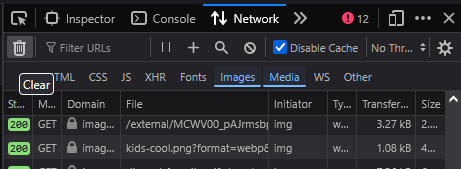

# discord-gif-downloader

## How to download your GIFs

### Step 1: Dump
- Go on [discord.com/app](https://discord.com/app) from a browser
- Open F12 (DevTools)
- Go to Network tab
- Select only "Images" and "Media"
- Click on trashbin to empty logs

It should look like this:

- Open the GIF picker on Discord (ex: Your favorites)
- Then scroll inside from the picker's top to the bottom and let the Network tab fill with WEBPs, GIFs, MP4 links; etc...
- Once you reached the end, [export the .HAR](https://help.hackthebox.com/en/articles/9065188-exporting-firefox-and-chrome-network-logs)
- Download it as "discord.har" in the same folder as main.ts, the name here is important.

### Step 2: Extract URLs and download
- Install [Bun](https://bun.com/docs/installation) (or Node.js)
- Open cmd from Windows Explorer's access path, or if you're UNIX (Mac/Linux) your preferred SH
- `bun install`
- `bun run main.ts`

## Why I have to scroll and make all that stuff???
Well, since Discord caches your “GIFs,” which are no longer GIFs in the 21st century, as this format is obsolete. GIFs are now a seamless integration of animated WEBP, MP4, and APNG. This reduces bandwidth and offers better quality, which many third-party services have done, including Discord.

But for many years, Discord had left their CDN open and unprotected, and many users had problems because a simple CDN link could be used to start tracking channels and users. All of this leads now to a CDN and a cache under an authorization token, which is needed to access easily to your GIFs. To be honest it is a bit complicated to do without, and so that ambiguous way is the most reliable to download your GIF collection directly from Discord's CDN cache.

This is the main problem with this project that inspired me and don't use the Discord's CDN cache: [github.com/womblee/discord-favorite-gif-downloader](https://github.com/womblee/discord-favorite-gif-downloader)

## Supports
- Any browser that have a HAR export.
- And a computer where Bun or Node can run.

## Contribute
### PR Feature welcomed
- Since the .HAR file already contains the response data for all medias, but its format is sometimes strange, I download it again from Discord's CDN cache. The best thing would be to grab their base64 and make the blob accordingly. So both making an offline-mode that takes data from the .HAR, and keeping the current online-mode that download from Discord's CDN cache. (Maybe a scanf choice thing with `1` for offline or `2` for online)